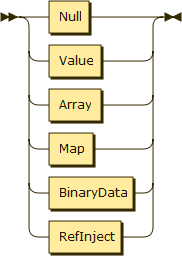
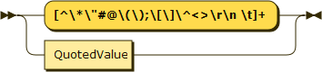

Wexpr Spec 0.1 - 2018-04-19
==========

# DRAFT

Textual format
-----------------

General format is UTF-8. EBNF can be found [here](wexpr.ebnf)

### Expression

A document consists of a single expression, which must be complete and correct (or empty which is a Null expression).

An expression is one of the following types:
- Null
- Value
- Array
- Map
- BinaryData

Each of these is covered below.

_Expression_: 

_Actual Expression_: 

_RefNamedExpression_: 

_NormalExpression_: 

### Null

A null expression is just 'null' or 'nil'.

_Null_: 

### Value:

A value is a single value. A value can either be quoted (which allows the full range of a string) or as a bareword, which has a few character limitations. Things like numbers are also values such as 2.0. The implementation or program decodes the value to whatever type they wish to use it as. The list of restricted characters in barewords include: '*', '#', '@', '(', ')', '[', ']', '^', '\r', '\n', '\t', ' ', '<', '>'. A bareword value also cannot be the words 'nil' or 'null' since those are null expressions.

The implementation can decide to interpret values into child types as it desires. Commonly, true/false as a boolean type, and numbers as integers or floating point.

_Value_: 

_QuotedValue_: 

_EscapableString_: 

_EscapedCharacter_: 

### Array:

An array is a sequence of values. Order is preserved, and the child expressions are fetchable via index.

_Array_: 

### Map:

A map is a set of key, value pairs which are accessible via the keys. Order is not required to be preserved by the implementation. Keys are required to be values.

_Map_: 

### BinaryData:

Binary data is a direct set of Base64 characters used to encode binary data.

_BinaryData_: 

Parser only constructs. These are not part of the expression tree and are generally thrown away after parsing.
------------------------------------------------------------------

### Comment:

Comments are allowed anywhere white space is allowed.

Single line comments start with `;` and continue to the next newline. Nothing within the comment should be interpreted.

Multi line comments start with `;(--` and continue to the next `--)` found. Any characters or sequence including newlines except `--)` are allowed within the comment (since `--)` will end the comment).

_LineComment_: 

_BlockComment_: 

### References:

A reference is essentially an identifer you tie to an expression. It marks an expression, which can then be recalled or injected at a different point in the file. For example `@(a [ref]10 b [*ref])` assigned ref to the expression '10' and then gave b the same value.

_RefDeclaration_: 

_RefInject_: 

_Identifier_: 

---

Railroad diagrams generated by [Railroad Diagram Generator](http://bottlecaps.de/rr/ui).
